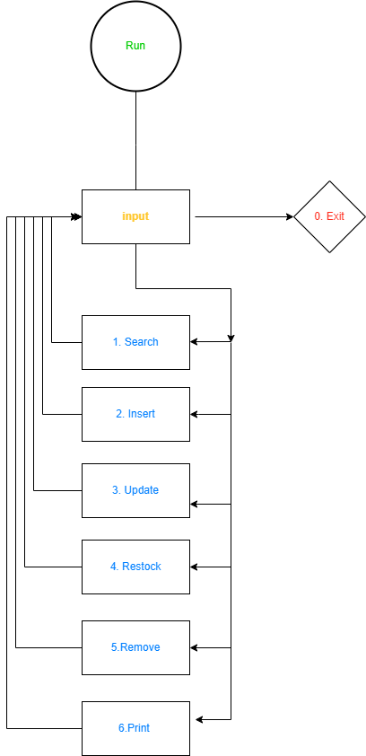
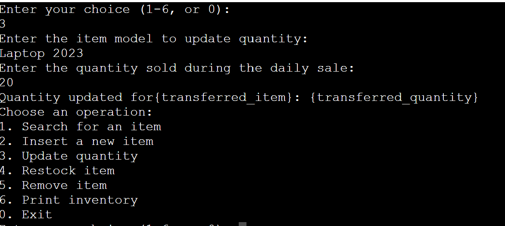

# Inventory Tracker

This is a Python code for an Inventory Tracker that uses Google Sheets to store and manage item data. The code provides functionality to connect to a Google Sheets document, create an inventory table, insert new items, search for items, update item quantities, restock items, remove items, and print the inventory.

## Overview
The inventory tracking program is designed for individuals or businesses that need to manage and keep track of their inventory. It can be used by store owners, warehouse managers, inventory control teams, or any individual or organization that deals with maintaining and monitoring stock levels of products or items.

## Prerequisites

Before running the code, ensure that you have the following:

- Python 3.x installed on your system.
- The necessary Python packages installed, including `gspread` and `google-auth`.
- A Google Sheets document created for your inventory.
- A service account with a service account key file (JSON format) obtained from the Googe Cloud Console

## Getting Started

- Clone the repository or download the inventory_tracker.py file.
- Rename the service account key file to credentials.json and place it in the same directory as the Python script.
- Install the required Python packages by running pip install gspread google-auth.
- Open the terminal and run the Python script using python inventory_tracker.py.

## Usage
 

Upon running the code, the program will display a menu with the following options:
 
1. Search for an item
2. Insert a new item
3. Update quantity
4. Restock item
5. Remove item
6. Print inventory
0. Exit

Enter the number corresponding to the desired operation and follow the prompts to provide the necessary information.

## Example
Choose an operation:
1. Search for an item
2. Insert a new item
3. Update quantity
4. Restock item
5. Remove item
6. Print inventory
0. Exit

Enter your choice (1-6, or 0): 1
Enter the item model or shorthand code to search: Laptop
Matching items:
Item: Laptop, Quantity: 5

...

Choose an operation:
1. Search for an item
2. Insert a new item
3. Update quantity
4. Restock item
5. Remove item
6. Print inventory
0. Exit

Enter your choice (1-6, or 0): 0
Exiting the inventory tracking application.

## Testing Steps/Guidelines
Before testing the application, ensure that you have completed the prerequisites and have set up the Google Sheets document with the correct structure.

## Connect to the Spreadsheet:

Verify that the application connects to the Google Sheets document named "inventory" successfully.
Check for any connection errors and ensure the main menu is displayed after successful connection.

## Insert a New Item:

Verify that you can add a new item to the inventory with a valid item model and positive integer quantity.
Check that the program provides appropriate feedback for empty or invalid data entry.
Check the Google Sheets document to ensure the new item and quantity have been added correctly.

## Search for an Item:

Verify that the application can search for an existing item by its name or shorthand code.
Check that the program provides informative messages when the item is not found or when the search input is empty.
Update Quantity:

Verify that the application can update the quantity of an existing item based on the quantity sold during the daily sale.
Check that the program handles invalid data entry, such as non-integer quantities.
Check the Google Sheets document to ensure the quantity is updated correctly.

## Restock Item:

Verify that you can restock an existing item with an additional quantity.
Check that the program handles invalid data entry, such as non-integer quantities.
Check the Google Sheets document to ensure the item has been restocked correctly.

## Remove Item:

Verify that you can remove an existing item from the inventory.
Check that the program provides confirmation messages before proceeding with the removal.
Check the Google Sheets document to ensure the item has been removed correctly.

## Print Inventory:

Verify that the application can print the entire inventory with item names and quantities.
Check that the program provides informative messages if the inventory is empty.

## Invalid Inputs:

Test the program with various invalid inputs, such as providing an empty item model, non-integer quantities, and incorrect item names.
Verify that the application handles such inputs gracefully and displays appropriate error messages.

## Exit the Application:

Verify that the application can be terminated gracefully without any errors.

## Database Structure

The inventory is stored in a Google Sheets document with the following columns:
- Item Model
- Quantity

## Note

- When searching for an item, you can enter either the item model or a shorthand code. The application will return matching items based on the input.

## Issues Found

- The `Restock` method was not finding the items. The code should have been using `get_all_values()` instead of `get_all_records()`.
I found a issue while removing the item from the list. it was removing any item that had a quantity of one.

- Having the code truncated this way so the validator pass with error causes  the next error.
 print(f"Quantity updated for" +
            "{transferred_item}: {transferred_quantity}")

to fix it I changed it to 
print(f"Updated:{transferred_quantity} for {transferred_item}")

## Acknowledgements

The Inventory Tracker application was developed as a programming school project.

## Future Additions

The addition of a UI.

## Credit
- https://stackoverflow.com/questions/41684523/how-can-i-add-validation-for-input-length-of-a-string
 if len(item_model) < 3:
                    print("Can not be less than 3 ")

- google: sheet API 
- CI : SCOPE = [
            "https://www.googleapis.com/auth/spreadsheets",
            "https://www.googleapis.com/auth/drive.file",
            "https://www.googleapis.com/auth/drive"
        ]
- https://python-forum.io/thread-28805.html
- data = self.stock.get_all_values()

## DEPLOYMENT
I Created an account on HEROKU and configured it
After I created it a new app. chose the name on lowercase and country
I went to settings added. the CREDS into the vars field
Added heroku python, node.js buildpacks
then on the deploy tab I choose. the deployment metho and chosed github
I deployed the app.
https://inventory-tracker-app-725424cf8abe.herokuapp.com
