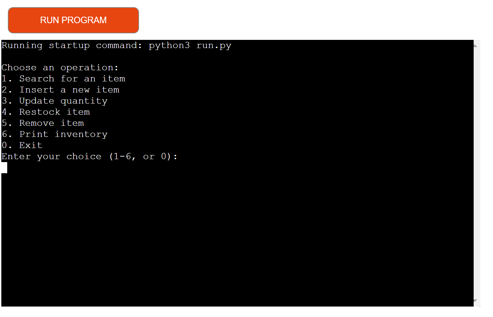
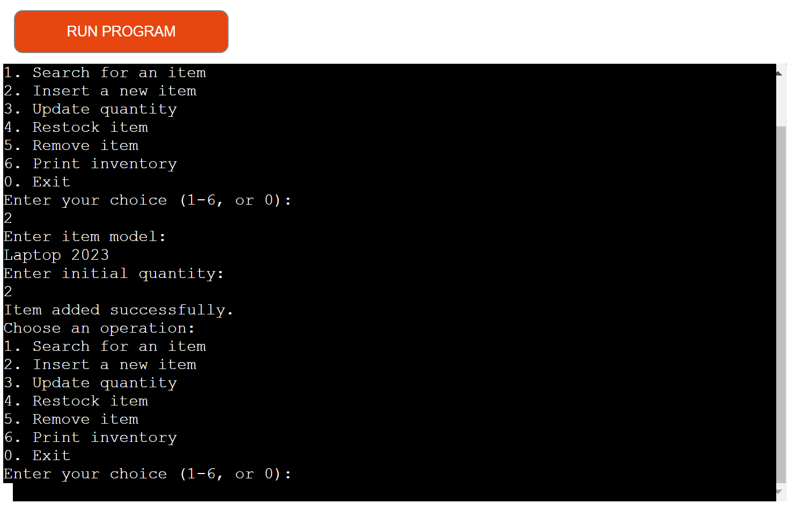
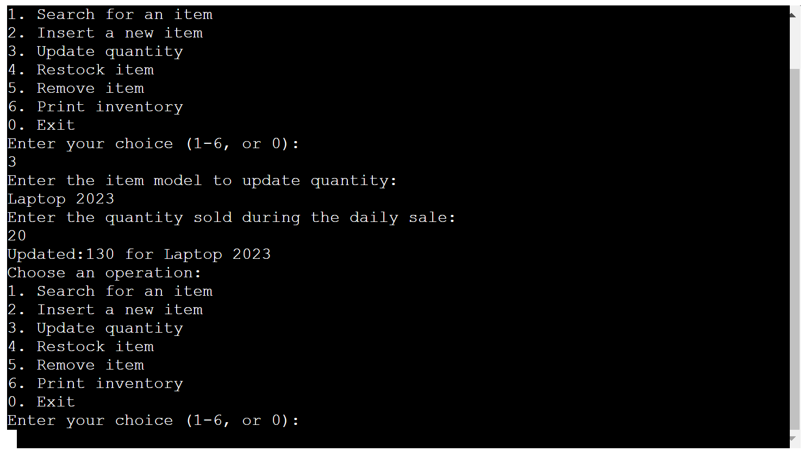
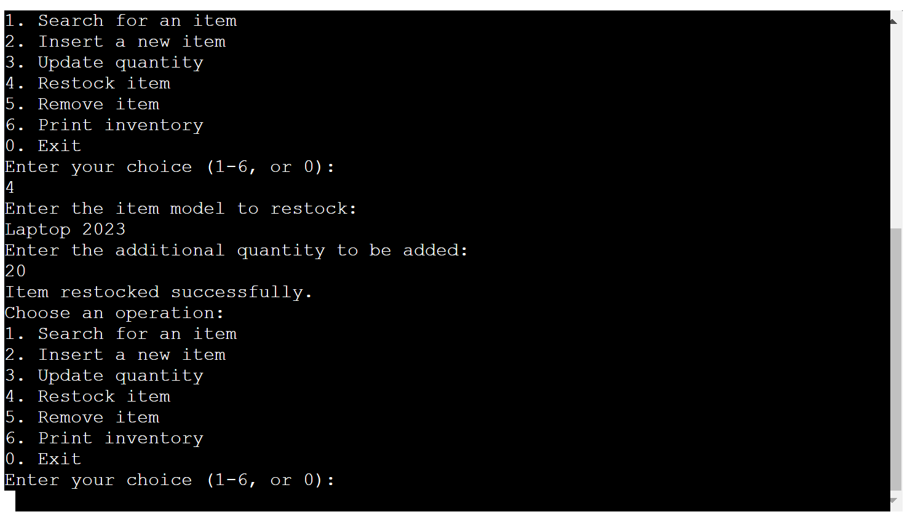
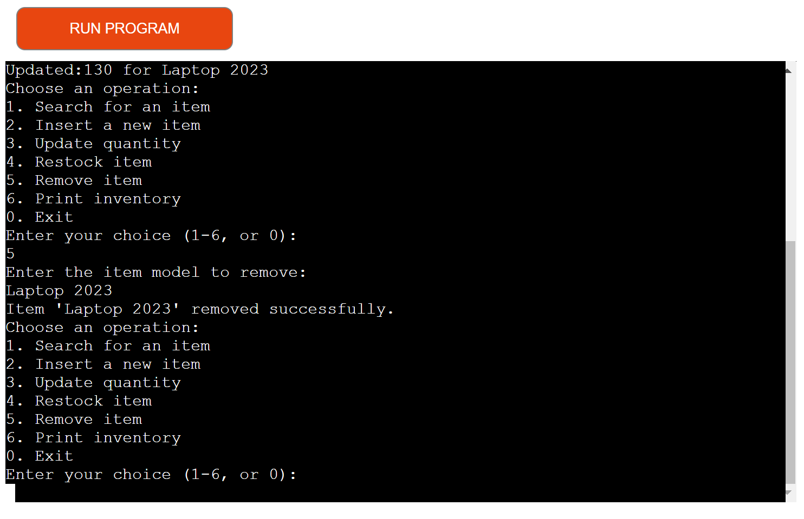
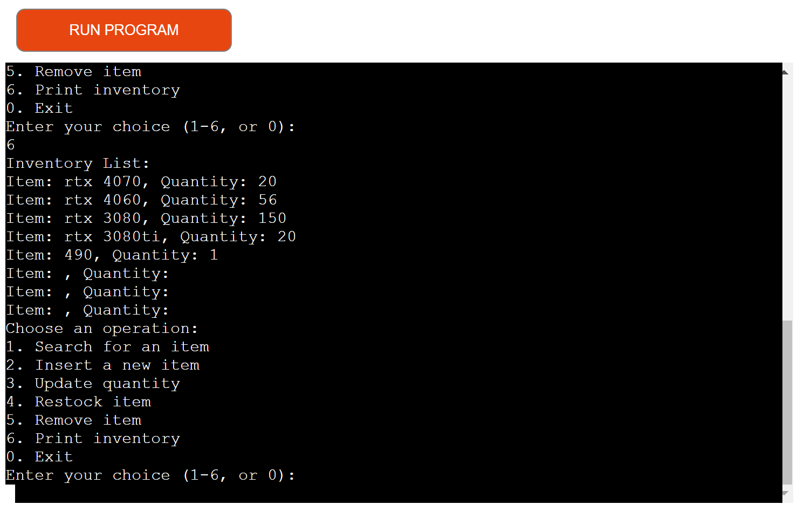

# Inventory Tracker

This is a Python code for an Inventory Tracker that uses Google Sheets to store and manage item data. The code provides functionality to connect to a Google Sheets document, create an inventory table, insert new items, search for items, update item quantities, restock items, remove items, and print the inventory.

## Overview
The inventory tracking program is designed for individuals or businesses that need to manage and keep track of their inventory. It can be used by store owners, warehouse managers, inventory control teams, or any individual or organization that deals with maintaining and monitoring stock levels of products or items.

## Prerequisites

Before running the code, ensure that you have the following:

- Python 3.x installed on your system.
- The necessary Python packages installed, including `gspread` and `google-auth`.
- A Google Sheets document created for your inventory.
- A service account with a service account key file (JSON format) obtained from the Googe Cloud Console

## Getting Started

1. Make sure you have a Google Sheets document created for your inventory.
2. Create a service account and download the service account key file (JSON format) from the Google Cloud Console.
3. Rename the service account key file to `credentials.json` and place it in the same directory as the Python script.
4. Open the `inventory_tracker.py` file.
5. Run the Python script using `python inventory_tracker.py`.

## Usage

Upon running the code, the program will display a menu with the following options:

1. Search for an item
2. Insert a new item
3. Update quantity
4. Restock item
5. Remove item
6. Print inventory
0. Exit

Enter the number corresponding to the desired operation and follow the prompts to provide the necessary information.

## Example
Choose an operation:
1. Search for an item
2. Insert a new item
3. Update quantity
4. Restock item
5. Remove item
6. Print inventory
0. Exit

Enter your choice (1-6, or 0): 1
Enter the item model or shorthand code to search: Laptop
Matching items:
Item: Laptop, Quantity: 5

Choose an operation:
1. Search for an item
2. Insert a new item
3. Update quantity
4. Restock item
5. Remove item
6. Print inventory
0. Exit

Enter your choice (1-6, or 0): 2
Enter item model: Laptop
Enter initial quantity: 5
Item added successfully.

Choose an operation:
1. Search for an item
2. Insert a new item
3. Update quantity
4. Restock item
5. Remove item
6. Print inventory
0. Exit

Enter your choice (1-6, or 0): 3
Enter the item model to update quantity: Laptop
Enter the quantity sold during the daily sale: 2
Quantity updated for Laptop: 3

Choose an operation:
1. Search for an item
2. Insert a new item
3. Update quantity
4. Restock item
5. Remove item
6. Print inventory
0. Exit

Enter your choice (1-6, or 0): 4
Enter the item model to restock: Laptop
Enter the additional quantity to be added: 10
Item restocked successfully.
Matching items:
Item: Laptop, Quantity: 13

Choose an operation:
1. Search for an item
2. Insert a new item
3. Update quantity
4. Restock item
5. Remove item
6. Print inventory
0. Exit

Enter your choice (1-6, or 0): 5
Enter the item model to remove: Laptop
Item 'Laptop' removed successfully.

Choose an operation:
1. Search for an item
2. Insert a new item
3. Update quantity
4. Restock item
5. Remove item
6. Print inventory
0. Exit

Enter your choice (1-6, or 0): 6
Inventory List:

Choose an operation:
1. Search for an item
2. Insert a new item
3. Update quantity
4. Restock item
5. Remove item
6. Print inventory
0. Exit

Enter your choice (1-6, or 0): 0
Exiting the inventory tracking application.

## Database Structure

The inventory is stored in a Google Sheets document with the following columns:
- Item Model
- Quantity

## Note

- When searching for an item, you can enter either the item model or a shorthand code. The application will return matching items based on the input.

## Issues Found

- The `Restock` method was not finding the items. The code should have been using `get_all_values()` instead of `get_all_records()`.
I found a issue while removing the item from the list. it was removing any item that had a quantity of one.

- Having the code truncated this way so the validator pass with error causes  the next error.
 print(f"Quantity updated for" +
            "{transferred_item}: {transferred_quantity}")

to fix it I changed it to 
print(f"Updated:{transferred_quantity} for {transferred_item}")

## Acknowledgements

The Inventory Tracker application was developed as a programming school project.

## Future Additions

The addition of a UI.

## Credit
- https://stackoverflow.com/questions/41684523/how-can-i-add-validation-for-input-length-of-a-string
 if len(item_model) < 3:
                    print("Can not be less than 3 ")

- google: sheet API 
- CI : SCOPE = [
            "https://www.googleapis.com/auth/spreadsheets",
            "https://www.googleapis.com/auth/drive.file",
            "https://www.googleapis.com/auth/drive"
        ]
- https://python-forum.io/thread-28805.html
- data = self.stock.get_all_values()

## DEPLOYMENT
I Created an account on HEROKU and configured it
After I created it a new app. chose the name on lowercase and country
I went to settings added. the CREDS into the vars field
Added heroku python, node.js buildpacks
then on the deploy tab I choose. the deployment metho and chosed github
I deployed the app.
https://inventory-tracker-app-725424cf8abe.herokuapp.com
